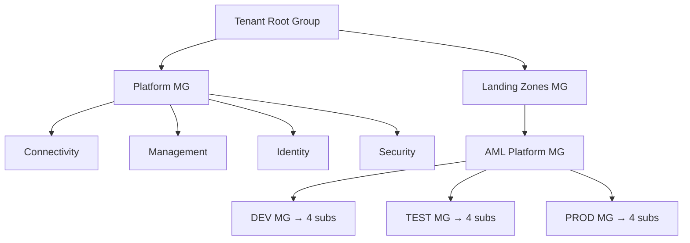

# Azure Machine Learning – Scale-Out Reference Architecture

A reference architecture and decision record for scaling an Azure Machine Learning estate from a **single subscription** to a **landing-zone topology** that stays within Azure subscription limits.

The scenario: **100 ML products × 3 environments (dev / test / prod) × 1 AML workspace each**, with every workspace backed by a **14-node batch compute cluster**. A single subscription cannot host this — it breaches the regional caps on endpoints (100), compute targets (2,500 max), and per-VM-family core quota.

## TL;DR

- Move from **1 subscription** → **12 application landing-zone subscriptions** (`4 product-groups × 3 environments`) plus **4 platform subscriptions** (connectivity, management, identity, security).
- **25 products per subscription** → ≥ 4× headroom on every AML regional limit.
- Hub-and-spoke networking, private endpoints, subscription vending via IaC.
- All workloads are batch → prefer **batch endpoints** with multiple deployments per endpoint (≤ 20) and low-priority cores.

## Contents

- [`docs/AML-Scale-Out-Architecture.md`](docs/AML-Scale-Out-Architecture.md) – full architecture document (Confluence-style), including:
  - Why the current single-subscription design hits limits
  - Target management-group and subscription topology (Mermaid)
  - Per-subscription landing-zone layout (Mermaid)
  - Quota math diagram (Mermaid)
  - Splitting strategy, design principles, implementation blueprint
  - Risks, trade-offs, mitigations
  - Microsoft Learn reference links
  - Decision log

## Target topology at a glance



## Key Microsoft Learn references

- [Manage and increase quotas for Azure Machine Learning](https://learn.microsoft.com/azure/machine-learning/how-to-manage-quotas?view=azureml-api-2)
- [Azure subscription and service limits](https://learn.microsoft.com/azure/azure-resource-manager/management/azure-subscription-service-limits)
- [CAF – Subscription considerations and recommendations](https://learn.microsoft.com/azure/cloud-adoption-framework/ready/landing-zone/design-area/resource-org-subscriptions)
- [CAF – Subscription vending](https://learn.microsoft.com/azure/cloud-adoption-framework/ready/landing-zone/design-area/subscription-vending)
- [Azure landing zone design areas](https://learn.microsoft.com/azure/cloud-adoption-framework/ready/landing-zone/design-areas)
- [Azure Machine Learning as a data product for cloud-scale analytics](https://learn.microsoft.com/azure/cloud-adoption-framework/scenarios/cloud-scale-analytics/best-practices/azure-machine-learning)

## Repository layout

```
.
├── README.md                                 # This file
└── docs/
    └── AML-Scale-Out-Architecture.md         # Full architecture document
```

## Viewing the diagrams

All architecture diagrams are authored in **Mermaid** and render natively on GitHub — just open the markdown files in the browser.

## Contributing

This is a decision-record repository. Propose changes via pull request:

1. Fork and branch (`feat/<short-topic>`).
2. Keep diagrams in Mermaid (no binary diagram files).
3. Link every design claim to Microsoft Learn where possible.
4. Update the **Decision log** in `docs/AML-Scale-Out-Architecture.md` when a principle changes.

## License

MIT — see [`LICENSE`](LICENSE) if present, otherwise treat content as MIT-licensed documentation.
