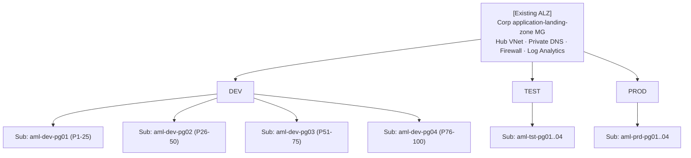

# Azure Machine Learning – Scale-Out Reference Architecture

Architecture pattern for scaling an Azure Machine Learning estate from a **single subscription** to multiple AML-dedicated subscriptions, **without re-designing the existing Azure Landing Zone** and **reusing the existing subscription-stamping pipeline**.

## Scenario

- **100 ML products × 3 environments (dev / test / prod)** → 300 AML workspaces.
- Each workspace has a **14-node batch compute cluster**; all workloads are **batch**.
- **Everything currently in one subscription** → hitting hard AML regional caps (100 endpoints, 2,500 compute targets, VM core quotas).

## Scope

| In scope | Out of scope (already in place) |
|---|---|
| AML workspaces, compute clusters, batch endpoints | Azure Landing Zones (MGs, policies, hub-and-spoke, central logging, identity) |
| ADLS Gen2, Key Vault, App Insights, ACR bound to AML | The organisation's existing **subscription-stamping pipeline** |
| AML-specific private endpoints + DNS zone links | Firewall, ExpressRoute, Sentinel, Defender |
| Product onboarding flow, quota operating model, naming | Tenant-level identity, Entra group governance |

This document defines the **AML stamp** — the AML-specific module set that the existing stamping pipeline must be extended with.

## TL;DR

- Vend **12 AML-dedicated subscriptions** (`4 product-groups × 3 environments`) under the existing Corp application-landing-zone MG.
- **25 products per subscription** → ≥ 4× headroom on every AML regional limit.
- Add **two new modules** to the existing stamping pipeline:
  - `aml-sub-shared` — runs once per subscription (shared ACR, DNS zone links, diagnostic routing).
  - `aml-product-stamp` — runs once per product per env (workspace + storage + KV + AI + 14-node cluster + batch endpoint + PEs).
- Prefer **batch endpoints** with multiple deployments per endpoint (≤ 20) to multiply model-version capacity without burning endpoint count.
- Scale to 200 / 400 / 1,000 products by vending more `pg*` subscriptions — design is linear.

## Target topology (AML-only view)



## Contents

- [`docs/AML-Scale-Out-Architecture.md`](docs/AML-Scale-Out-Architecture.md) — full architecture document, including:
  - Scope and assumptions (ALZ + stamping pre-existing)
  - Why AML limits force subscription fan-out
  - **AML stamp** definition (authoritative resource list)
  - Quota math
  - Splitting strategy, design principles
  - Implementation blueprint (how to extend the stamping pipeline)
  - Batch-workload tuning
  - Risks, mitigations
  - Scaling beyond 100 products
  - Microsoft Learn references
  - Decision log

## Key Microsoft Learn references

- [Manage and increase quotas for Azure Machine Learning](https://learn.microsoft.com/azure/machine-learning/how-to-manage-quotas?view=azureml-api-2)
- [Azure Machine Learning service limits](https://learn.microsoft.com/azure/machine-learning/resource-limits-capacity?view=azureml-api-2)
- [Azure subscription and service limits](https://learn.microsoft.com/azure/azure-resource-manager/management/azure-subscription-service-limits)
- [AML as a data product for cloud-scale analytics](https://learn.microsoft.com/azure/cloud-adoption-framework/scenarios/cloud-scale-analytics/best-practices/azure-machine-learning)
- [Batch endpoints concept](https://learn.microsoft.com/azure/machine-learning/concept-endpoints-batch?view=azureml-api-2)
- [Quota Groups](https://learn.microsoft.com/azure/quotas/quota-groups)

## Repository layout

```
.
├── README.md                                 # This file
└── docs/
    └── AML-Scale-Out-Architecture.md         # Full architecture document
```

## Viewing the diagrams

All diagrams are authored in **Mermaid** and render natively on GitHub.

## Contributing

1. Fork and branch (`feat/<short-topic>`).
2. Keep diagrams in Mermaid (no binary diagram files).
3. Link every design claim to Microsoft Learn where possible.
4. Update the **Decision log** in `docs/AML-Scale-Out-Architecture.md` when a principle changes.

## License

MIT — see `LICENSE` if present, otherwise treat content as MIT-licensed documentation.
