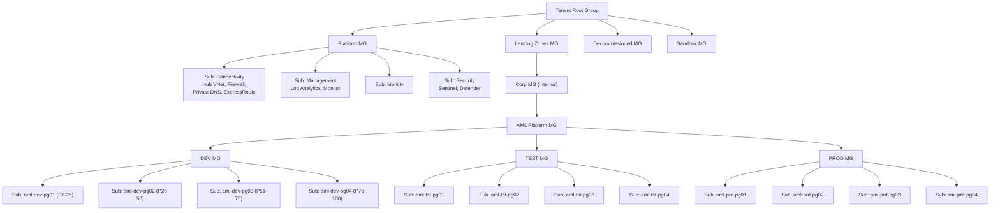
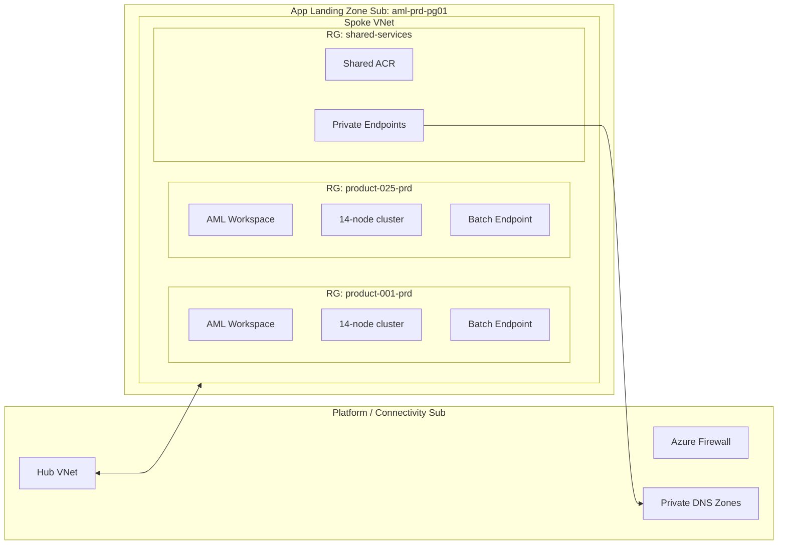
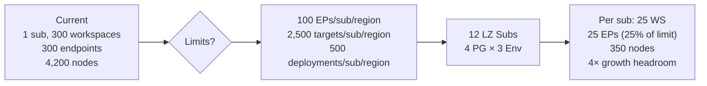

# Azure Machine Learning – Scale-Out Reference Architecture

> **Status:** Draft for review
> **Owner:** Platform / ML Platform Team
> **Last updated:** April 2026
> **Audience:** Cloud Architects, ML Platform Engineers, Product ML Leads, FinOps, Security

---

## 1. Executive summary

The current AML estate runs **100 ML products × 3 environments (dev / test / prod) × 1 AML workspace each** inside a **single Azure subscription**, with every workspace backed by a **14-node compute cluster** running **batch** workloads. The platform is now hitting hard subscription-scoped limits:

| Limit (default, regional, per subscription) | Value | Where we are |
|---|---|---|
| Online + batch **endpoints** per subscription per region | **100** | 300 needed (300 workspaces × 1 endpoint) |
| **Deployments** per subscription per region (sum of online + batch) | **500** | At risk |
| **Total compute targets** per region (train clusters + CI + managed online deployments) | **500 default, 2,500 max** | 300 clusters consumes headroom |
| Dedicated cores per VM family per region | 24 – 300 default | Constrains scale-out |

Sources: [Manage quotas for Azure Machine Learning](https://learn.microsoft.com/azure/machine-learning/how-to-manage-quotas?view=azureml-api-2), [Azure subscription and service limits](https://learn.microsoft.com/azure/azure-resource-manager/management/azure-subscription-service-limits).

**Decision:** Treat the **Azure subscription as a scale unit** (the CAF-recommended pattern) and move from 1 subscription to a **landing-zone topology** of **12 application subscriptions (4 product-group subs × 3 environments) + 4 platform subscriptions**, aligned with the [Azure Landing Zone reference architecture](https://learn.microsoft.com/azure/cloud-adoption-framework/ready/landing-zone/) and [Cloud-scale analytics AML guidance](https://learn.microsoft.com/azure/cloud-adoption-framework/scenarios/cloud-scale-analytics/best-practices/azure-machine-learning).

---

## 2. Why we are hitting limits (the "what")

All the limits above are **regional per subscription**. They are **credit limits, not capacity guarantees** — raising them does **not** guarantee capacity, and some limits (endpoint count, deployment count) still cap out even with an exception.

Three specific facts matter:

1. **Endpoints cap at 100 per subscription per region** – exceptions can be requested but are not elastic. At 300 endpoints needed, one subscription is structurally non-viable. ([Docs](https://learn.microsoft.com/azure/machine-learning/how-to-manage-quotas?view=azureml-api-2#azure-machine-learning-online-endpoints-and-batch-endpoints))
2. **Total compute targets cap at 2,500 per region even after a support ticket** – training clusters, compute instances **and** managed online deployments all count against the same pool. ([Docs](https://learn.microsoft.com/azure/machine-learning/how-to-manage-quotas?view=azureml-api-2#azure-machine-learning-compute))
3. **VM core quotas are per subscription per VM family per region** – 300 clusters × 14 nodes will starve any single core quota. ([Docs](https://learn.microsoft.com/azure/machine-learning/how-to-manage-quotas?view=azureml-api-2))

The [CAF subscription design area](https://learn.microsoft.com/azure/cloud-adoption-framework/ready/landing-zone/design-area/resource-org-subscriptions#subscription-considerations) explicitly calls subscriptions **"boundaries for scale, quota, cost, governance, security, and identity"** and recommends: *"Use subscriptions as scale units, and scale out resources and subscriptions as required."*

---

## 3. Target architecture (the "what")

### 3.1 Management group & subscription topology



### 3.2 Per-subscription application landing zone

Each of the **12 workload subscriptions** hosts **25 products** (one AML workspace per product). Within the subscription:

- One **spoke VNet**, peered to the central hub in the platform Connectivity subscription.
- One **resource group per product** (blast-radius isolation, RBAC boundary, cost tag root).
- One **shared-services resource group** per subscription for: shared ACR, private endpoints, shared Log Analytics link, shared Key Vault for platform secrets.
- Each product RG: `AML Workspace + ADLS Gen2 + Key Vault + App Insights + 14-node AmlCompute cluster + Batch Endpoint`.



### 3.3 Quota math – why 25 products per subscription



| Item | 1-sub today | 12-sub target (per sub) | % of default limit |
|---|---|---|---|
| AML workspaces | 300 | 25 | n/a |
| Batch endpoints | 300 | 25 | 25% of 100 |
| Deployments | 300 | 25 | 5% of 500 |
| Compute clusters | 300 | 25 | 5% of 500 total targets |
| Compute nodes | 4,200 | 350 | Sized per VM family core quota |

Every limit has **≥ 4× headroom** before the next split is needed, which gives room for product growth and for exception-only endpoint limit raises to buffer peaks.

---

## 4. Splitting strategy – choosing the partition key (the "how")

Five axes could split 100 products. Pick one primary axis, use RGs/tags for the rest.

| Partition axis | Pros | Cons | Verdict |
|---|---|---|---|
| **By environment (dev / test / prod)** | Strict blast-radius; separate RBAC; CAF-aligned; different policy + SLA | Doesn't solve quota alone at 100 products | **Use (primary)** |
| **By product-group (25 per sub)** | Directly solves endpoint + target limits; simple math | Arbitrary grouping boundary | **Use (secondary)** |
| By business unit / domain | Clean chargeback | Uneven product counts per BU |  Use tags |
| By region | Needed for data residency / DR | Not required by quotas |  Only if regulation demands |
| Per product | Maximum isolation | 300 subs → management overhead, vending cost | Reject |

**Recommended partition:** `environment × product-group` → **12 landing-zone subscriptions**. Product-group membership is **derived from a hash or a registry** (e.g. `product_id mod 4`), kept stable to avoid workspace moves. Grow by adding a 5th product-group subscription per environment when a group crosses 20 products (80% of the 25-product budget).

---

## 5. Design principles (the "why")

The target design follows seven principles, each traceable to Microsoft guidance:

1. **Subscription = scale unit.** Scale horizontally by adding subscriptions, not by stacking workspaces. ([CAF subscription recommendations](https://learn.microsoft.com/azure/cloud-adoption-framework/ready/landing-zone/design-area/resource-org-subscriptions#subscription-recommendations))
2. **Separate platform from application landing zones.** Connectivity, identity, management, security live in platform subs; workloads never co-mingle with them. ([ALZ design areas](https://learn.microsoft.com/azure/cloud-adoption-framework/ready/landing-zone/design-areas))
3. **One workspace per project / lifecycle stage.** Dev, test, prod each get their own workspace; no shared prod workspace across products. ([AML for CAF cloud-scale analytics](https://learn.microsoft.com/azure/cloud-adoption-framework/scenarios/cloud-scale-analytics/best-practices/azure-machine-learning#implementation-overview))
4. **Hub-and-spoke networking with private endpoints.** All AML data-plane traffic flows through private endpoints resolved in centralized private DNS zones. ([Landing zone networking](https://learn.microsoft.com/azure/cloud-adoption-framework/ready/landing-zone/design-area/network-topology-and-connectivity))
5. **Subscription vending + IaC everywhere.** New product groups are created via a subscription vending pipeline (Bicep/Terraform), not by ClickOps. ([Subscription vending](https://learn.microsoft.com/azure/cloud-adoption-framework/ready/landing-zone/design-area/subscription-vending))
6. **Policy and governance at the management group.** `AML-Platform` MG enforces: private-endpoint-only workspaces, allowed VM SKUs, diagnostic settings → central Log Analytics, required tags. ([ALZ policies](https://learn.microsoft.com/azure/architecture/landing-zones/bicep/landing-zone-bicep))
7. **Central observability, distributed ownership.** Every workspace streams diagnostics and App Insights to the Management subscription; product teams own their RGs and cost tags.

---

## 6. Implementation blueprint (the "how")

### 6.1 Management group hierarchy

```
Tenant Root
├── Platform
│   ├── sub-platform-connectivity
│   ├── sub-platform-management
│   ├── sub-platform-identity
│   └── sub-platform-security
├── Landing Zones
│   └── Corp
│       └── AML-Platform
│           ├── DEV      → 4 subscriptions
│           ├── TEST     → 4 subscriptions
│           └── PROD     → 4 subscriptions
├── Sandbox
└── Decommissioned
```

### 6.2 Naming convention

| Resource | Pattern | Example |
|---|---|---|
| Subscription | `sub-aml-{env}-pg{nn}` | `sub-aml-prd-pg01` |
| Resource group | `rg-aml-{env}-p{product_id}` | `rg-aml-prd-p042` |
| Workspace | `mlw-{env}-p{product_id}-{region}` | `mlw-prd-p042-weu` |
| Compute cluster | `cpu-batch-14n` / `gpu-batch-14n` | (same name reused per workspace) |
| Batch endpoint | `bep-p{product_id}-{purpose}` | `bep-p042-scoring` |

### 6.3 Subscription vending pipeline

1. **Intake form** (ServiceNow / GitHub issue): product_id, data classification, expected VM SKU, peak node count.
2. **Automated allocator** computes target product-group subscription:
   - If any existing `aml-{env}-pg*` has < 20 workspaces **and** < 80 endpoints **and** matching region/SKU → place there.
   - Else vend a new subscription under the correct MG via the [ALZ Bicep accelerator](https://learn.microsoft.com/azure/architecture/landing-zones/bicep/landing-zone-bicep) + [AVM modules](https://azure.github.io/Azure-Verified-Modules/).
3. **Post-vending bootstrap** (Terraform / Bicep): VNet spoke peering, private DNS links, ACR, Log Analytics link, policy assignments, RBAC groups.
4. **Product deployment** (product team, GitOps): workspace + datastore + cluster + endpoint via [AML CLI v2](https://learn.microsoft.com/azure/machine-learning/how-to-configure-cli).

### 6.4 Quota operating model

- **Quota Groups** to pool VM core quotas across the 4 product-group subs of the same environment. ([Quota Groups](https://learn.microsoft.com/azure/quotas/quota-groups))
- **Programmatic quota requests** through [Microsoft.Quota REST API](https://learn.microsoft.com/rest/api/quota/) fired from the vending pipeline.
- **Quota alerts** at 75% utilization per subscription per VM family. ([Configure alerts](https://learn.microsoft.com/azure/quotas/how-to-guide-monitoring-alerting))
- **Endpoint-limit increase requests** pre-filed for `prd` subs that cross 70 endpoints, per the [request process](https://learn.microsoft.com/azure/machine-learning/how-to-manage-quotas?view=azureml-api-2#endpoint-limit-increases).

### 6.5 Batch-workload specific tuning

Because **all workloads are batch**, exploit these:

- Prefer **batch endpoints** over managed online endpoints — no request-rate limit, scales to the cluster capacity. Each batch endpoint can host **multiple deployments** (up to 20) tied to the same 14-node cluster; ideal for model versioning without burning the endpoint count. ([Batch endpoints](https://learn.microsoft.com/azure/machine-learning/concept-endpoints-batch?view=azureml-api-2))
- Use **low-priority nodes** where SLA permits — separate quota pool (100 – 3,000 cores/region default) that doesn't compete with dedicated cores. ([Compute quotas](https://learn.microsoft.com/azure/machine-learning/how-to-manage-quotas?view=azureml-api-2#azure-machine-learning-compute))
- Set cluster **`min_instances=0`** with short idle timeout — 14 is the *max*, not a reservation.
- Consolidate models where possible: one workspace can host multiple products sharing a lifecycle; revisit the 1:1 workspace-to-product mapping for small products once the topology is live.

---

## 7. Risks, trade-offs, and mitigations

| Risk | Impact | Mitigation |
|---|---|---|
| Cross-subscription networking cost and complexity | Moderate | Hub-and-spoke minimizes cross-sub data egress; private endpoints keep data on the backbone |
| 12 subscriptions = 12× the governance surface | Moderate | Policies + RBAC inherited from `AML-Platform` MG; subscription vending templates enforce drift-free bootstrap |
| Product-group boundary becomes political | Low-Moderate | Allocation is hash-based and automated; documented promotion path when a group is "full" |
| Moving existing workspaces is hard | High | AML workspaces can't be moved cleanly across subscriptions with all artifacts; plan a **re-provision + model-registry re-publish** migration per product, not `az resource move` |
| Shared ACR limits (500 repos by default) | Low | One ACR per subscription is enough for 25 products; scale to one ACR per 3 product groups if repo density grows |
| Capacity is not guaranteed even after raising quota | High for GPU SKUs | Use [On-demand capacity reservations](https://learn.microsoft.com/azure/virtual-machines/capacity-reservation-overview) for critical prod GPU clusters |

---

## 8. Reference links

### Quotas and limits
- [Manage and increase quotas for Azure Machine Learning](https://learn.microsoft.com/azure/machine-learning/how-to-manage-quotas?view=azureml-api-2)
- [Azure Machine Learning service limits](https://learn.microsoft.com/azure/machine-learning/resource-limits-capacity?view=azureml-api-2)
- [Azure subscription and service limits](https://learn.microsoft.com/azure/azure-resource-manager/management/azure-subscription-service-limits)
- [Quota Groups](https://learn.microsoft.com/azure/quotas/quota-groups)
- [Microsoft.Quota REST API](https://learn.microsoft.com/rest/api/quota/)
- [Quota alerts & monitoring](https://learn.microsoft.com/azure/quotas/how-to-guide-monitoring-alerting)

### Cloud Adoption Framework – subscriptions and landing zones
- [Subscription considerations and recommendations](https://learn.microsoft.com/azure/cloud-adoption-framework/ready/landing-zone/design-area/resource-org-subscriptions)
- [Subscription vending](https://learn.microsoft.com/azure/cloud-adoption-framework/ready/landing-zone/design-area/subscription-vending)
- [Create and scale Azure subscriptions](https://learn.microsoft.com/azure/cloud-adoption-framework/ready/azure-setup-guide/initial-subscriptions)
- [Azure landing zone design areas and conceptual architecture](https://learn.microsoft.com/azure/cloud-adoption-framework/ready/landing-zone/design-areas)
- [Deploy Azure landing zones (ALZ accelerators)](https://learn.microsoft.com/azure/architecture/landing-zones/landing-zone-deploy)
- [ALZ Bicep modules](https://learn.microsoft.com/azure/architecture/landing-zones/bicep/landing-zone-bicep)
- [Azure Landing Zones FAQ – when to create new subscriptions](https://learn.microsoft.com/azure/cloud-adoption-framework/ready/enterprise-scale/faq)

### AML as a landing-zone data product
- [Azure Machine Learning as a data product for cloud-scale analytics](https://learn.microsoft.com/azure/cloud-adoption-framework/scenarios/cloud-scale-analytics/best-practices/azure-machine-learning)
- [What is an Azure Machine Learning workspace](https://learn.microsoft.com/azure/machine-learning/concept-workspace)
- [Batch endpoints concept](https://learn.microsoft.com/azure/machine-learning/concept-endpoints-batch?view=azureml-api-2)
- [On-demand capacity reservations](https://learn.microsoft.com/azure/virtual-machines/capacity-reservation-overview)

---

## 9. Decision log

| # | Decision | Rationale |
|---|---|---|
| D1 | Split by `env × product-group` → 12 workload subs | Solves 100-endpoint and 2,500-compute-target subscription limits with 4× headroom |
| D2 | 25 products per subscription | Leaves a 4× growth buffer on every AML-level limit |
| D3 | One workspace per product per env | CAF cloud-scale analytics guidance; matches lifecycle isolation |
| D4 | Hub-and-spoke with private endpoints | ALZ default, required for data residency and egress control |
| D5 | Subscription vending, IaC, AVM modules | Repeatable, drift-free, enforces policy at creation |
| D6 | Prefer batch endpoints + multiple deployments per endpoint | Batch-only workload; multiplies model-version capacity without new endpoints |
| D7 | Do not attempt `az resource move` for workspaces | Re-provision + model-registry re-publish is safer and well-trodden |

---

*End of document.*
