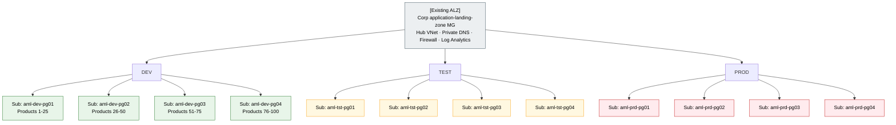
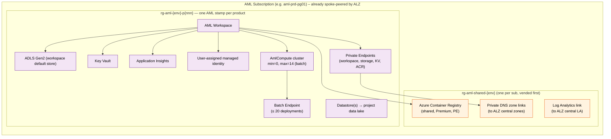
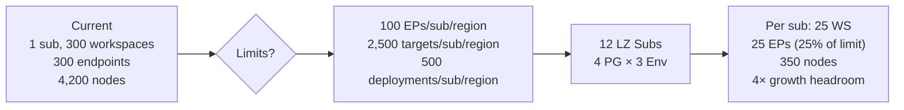

# Azure Machine Learning – Scale-Out Reference Architecture

> **Status:** Draft for review
> **Owner:** ML Platform Team
> **Last updated:** April 2026
> **Audience:** ML Platform Engineers, Product ML Leads, Cloud Architects, FinOps

---

## 0. Scope and assumptions

This document **only covers Azure Machine Learning and its directly-related resources**. The following are assumed to exist already and are **out of scope**:

- **Azure Landing Zones** (management groups, policies, hub-and-spoke networking, central logging, identity). This architecture deploys *into* an existing Corp application-landing-zone management group.
- **Subscription stamping / vending pipeline**. The organization already operates a stamping model for other workloads; **the gap this document closes is extending that stamping model to AML**.
- Identity (Entra groups / PIM), Sentinel, Defender, Log Analytics workspace, ExpressRoute, Firewall, central Private DNS zones.

What this document defines:

1. The **AML stamp** — the set of AML-specific resources that the stamping pipeline must produce inside an application-landing-zone subscription.
2. **How many AML stamps per subscription**, driven by AML regional quota limits.
3. **How to split 100 products across subscriptions** so the existing stamping pipeline can vend them predictably.
4. Day-2 operating rules for quotas, naming, and growth beyond 100 products.

---

## 1. Executive summary

The current AML estate runs **100 ML products × 3 environments (dev / test / prod) × 1 AML workspace each** inside a **single Azure subscription**, with every workspace backed by a **14-node compute cluster** running **batch** workloads. The platform is now hitting hard AML subscription-scoped limits:

| Limit (default, regional, per subscription) | Value | Where we are |
|---|---|---|
| Online + batch **endpoints** per subscription per region | **100** | 300 needed (300 workspaces × 1 endpoint) |
| **Deployments** per subscription per region (sum of online + batch) | **500** | At risk |
| **Total compute targets** per region (train clusters + CI + managed online deployments) | **500 default, 2,500 max** | 300 clusters consumes headroom |
| Dedicated cores per VM family per region | 24 – 300 default | Constrains scale-out |

Sources: [Manage quotas for Azure Machine Learning](https://learn.microsoft.com/azure/machine-learning/how-to-manage-quotas?view=azureml-api-2), [Azure subscription and service limits](https://learn.microsoft.com/azure/azure-resource-manager/management/azure-subscription-service-limits).

**Decision:** Define an **AML stamp** and plug it into the **existing subscription-stamping pipeline**. Scale horizontally by vending **12 AML-dedicated application subscriptions** (`4 product-groups × 3 environments`) under the existing Corp landing-zone hierarchy. Each subscription hosts **25 products** — 25 % of the endpoint cap, leaving ≥ 4× growth headroom. No new landing-zone, MG, networking, or identity design is introduced.

### 1.1 Architecture review outcome against the problem statement

This architecture **does address** the stated problem (subscription-level AML quota limits in a single-subscription model) and follows Microsoft guidance that subscriptions are a valid scale boundary in CAF.

| Problem statement ask | Architecture response | Outcome |
|---|---|---|
| 100 products × 3 workspaces in one subscription is hitting AML limits | Split by `environment × product-group` into 12 AML subscriptions (`4 groups × 3 env`) | ✅ Solves subscription-scoped endpoint and compute-target pressure |
| Need a scalable way to grow beyond 100 products | Deterministic packing rule `pg_index = ceil(product_id / 25)` and additive vending (`pg05`, `pg06`, …) | ✅ Linear scale-out with no reshuffle |
| All workloads are batch | Standardize on batch endpoints with up to 20 deployments per endpoint | ✅ Preserves endpoint headroom and supports model versioning |
| Need best-practice guidance on splitting across subscriptions | Reuse existing ALZ + subscription-stamping pipeline; add only `aml-sub-shared` and `aml-product-stamp` modules | ✅ Aligns with CAF subscription design and deployment-stamp patterns |
| Need Microsoft Learn references | Included in §8 (AML quotas, CAF subscription design/vending, deployment stamps, batch endpoints) | ✅ Complete |

**Residual actions required before rollout:** pre-approve VM-family core quota raises per AML subscription, enable Quota Groups per environment, and automate quota alerts at 75% utilization.

---

## 2. Why we are hitting limits (the "what")

All the limits above are **regional per subscription**. They are **credit limits, not capacity guarantees** — raising them does **not** guarantee capacity, and some limits (endpoint count, deployment count) still cap out even with an exception.

Three specific facts matter:

1. **Endpoints cap at 100 per subscription per region** – exceptions can be requested but are not elastic. At 300 endpoints needed, one subscription is structurally non-viable. ([Docs](https://learn.microsoft.com/azure/machine-learning/how-to-manage-quotas?view=azureml-api-2#azure-machine-learning-online-endpoints-and-batch-endpoints))
2. **Total compute targets cap at 2,500 per region even after a support ticket** – training clusters, compute instances **and** managed online deployments all count against the same pool. ([Docs](https://learn.microsoft.com/azure/machine-learning/how-to-manage-quotas?view=azureml-api-2#azure-machine-learning-compute))
3. **VM core quotas are per subscription per VM family per region** – 300 clusters × 14 nodes will starve any single core quota. ([Docs](https://learn.microsoft.com/azure/machine-learning/how-to-manage-quotas?view=azureml-api-2))

Because AML limits are hit at the **subscription** boundary, the only durable fix is to spread workspaces across more subscriptions. The existing stamping pipeline already knows how to vend subscriptions under the Corp landing-zone; this design simply defines the **AML stamp** to hand to it.

---

## 3. Target architecture (the "what")

### 3.1 AML subscription fan-out

AML-specific view only. Management groups, platform subscriptions, hub VNet, firewall, and central logging are **pre-existing ALZ components** and are shown as a single `[Existing ALZ]` reference.



**Totals:** 12 AML-dedicated subscriptions (no new platform subs, no MG changes).

### 3.2 The AML stamp — what the stamping pipeline must produce

When the stamping pipeline is asked to onboard a product, it deploys **one AML stamp** per product into the target subscription. A stamp is a single resource group with the AML workspace and its direct dependencies.



**Stamp contents (authoritative list):**

| Resource | Purpose | Sharing scope |
|---|---|---|
| AML Workspace | Control plane for the product | Per product |
| ADLS Gen2 (workspace default) | System artifacts, logs, job outputs | Per product |
| Key Vault | Workspace-linked secrets | Per product |
| Application Insights | Workspace telemetry | Per product |
| AmlCompute cluster (14-node batch) | Training + batch scoring | Per product |
| Batch endpoint (+ deployments) | Model serving | Per product |
| Datastore(s) | Link to project data lake (external) | Per product, read-only to shared data |
| Private endpoints for WS/ST/KV/ACR | Network isolation | Per product |
| User-assigned managed identity (`id-aml-{env}-p{nnn}`) | Credential-free access to ADLS, ACR, Key Vault, CMK | Per product |
| **Network isolation mode** | `AllowOnlyApprovedOutbound` — workspace blocks unapproved egress; only PE-approved destinations reachable | Per product |
| **Shared ACR** (one per subscription) | Environment images, model images | **Shared across 25 stamps in the sub** |
| **Private DNS zone links** | Resolve AML PE FQDNs through ALZ zones | **Shared per sub** (ALZ-owned zones) |
| **Log Analytics link** | Diagnostic routing to ALZ central LA | **Shared per sub** |

### 3.3 Quota math – why 25 products per subscription



| Item | 1-sub today | 12-sub target (per sub) | % of default limit |
|---|---|---|---|
| AML workspaces | 300 | 25 | n/a |
| Batch endpoints | 300 | 25 | 25% of 100 |
| Deployments | 300 | 25 | 5% of 500 |
| Compute clusters | 300 | 25 | 5% of 500 total targets |
| Compute nodes | 4,200 | 350 | Sized per VM family core quota |

Every limit has **≥ 4× headroom** before the next split is needed, which gives room for product growth and for exception-only endpoint limit raises to buffer peaks.

### 3.4 Full limit-by-limit audit

The table below covers **every** AML subscription-scoped limit and shows how the 25-products-per-sub packing affects it.

| AML limit | Scope | Default | Max (with exception) | Per-sub usage at 25 products | % of default | Solved by sub split? | Residual action |
|---|---|---|---|---|---|---|---|
| Endpoints (online + batch) | Sub / region | **100** | Exception-only | 25 | 25% | **Yes** | None |
| Deployments (online + batch) | Sub / region | **500** | Exception-only | 25 – 500 (if 20 per EP) | 5 – 100% | **Yes** | Keep avg ≤ 10 deployments/EP |
| Deployments per endpoint | Endpoint | **20** | Exception-only | 1 – 20 (model versions) | 5 – 100% | N/A (per-EP) | Lifecycle-manage old versions |
| Total compute targets | Sub / region | **500** | **2,500** | 25 clusters | 5% | **Yes** | Raise to 2,500 at vend time for prd |
| Dedicated cores per VM family | Sub / region / family | **24 – 300** (varies) | Raise via ticket | 25 × 14 × cores/node | **Exceeds default** | **Partially** — split gives separate pools | **Quota raise required per sub** |
| Low-priority cores per region | Sub / region | **100 – 3,000** | Raise via ticket | Only if using LP nodes | — | **Yes** (separate pool) | Use for non-SLA workloads |
| Total subscription core limit | Sub / region | Varies | Raise via ticket | 350 × cores/node | Likely exceeds | **Partially** | **Quota raise required per sub** |
| Workspaces per subscription | Sub | No hard limit | — | 25 | — | N/A | None |
| Workspace assets (datasets, runs, models) | Workspace | 10M each | — | Per product | — | N/A | None |
| Max run time | Run | 30 days | — | Batch dependent | — | N/A | None |

#### VM core quota — the limit that needs explicit action

Subscription splitting gives each sub its own VM core quota pool, but the **default quota is too low for 25 × 14-node clusters** regardless of SKU:

| VM SKU | Cores/node | Cores needed (25 × 14) | Default quota (typical) | Required raise |
|---|---|---|---|---|
| `Standard_DS3_v2` | 4 | **1,400** | ~100 (Dv2) | Raise to **1,500+** |
| `Standard_D16s_v5` | 16 | **5,600** | ~100 (Dv5) | Raise to **6,000+** |
| `Standard_NC6s_v3` (GPU) | 6 | **2,100** | 0 (GPU) | Raise from **0 to 2,500+** |

**Three mitigations are built into the architecture:**

1. **Automated quota raise at vend time** (§6.4) — the stamping pipeline fires a `Microsoft.Quota` REST API request immediately after subscription creation, before any workspace is deployed.
2. **`min_instances=0`** on every cluster (§6.5) — cores are only consumed when jobs are running. Peak demand is rarely all 25 clusters × 14 nodes simultaneously; the quota raise covers the theoretical max.
3. **Quota Groups** (§6.4) — pool VM core quotas across the 4 product-group subs in the same environment, so a sub running at 60% utilization can share unused cores with a sub peaking at 100%.

---

## 4. Splitting strategy – choosing the partition key (the "how")

AML limits are regional per subscription, so the partition key must map a product to exactly one AML subscription per environment.

| Partition axis | Pros | Cons | Verdict |
|---|---|---|---|
| **By environment (dev / test / prod)** | Strict blast-radius; separate RBAC; different SLA | Doesn't solve quota alone at 100 products | **Use (primary)** |
| **By product-group (25 per sub)** | Directly solves endpoint + target limits; simple math | Group boundary is arbitrary | **Use (secondary)** |
| By business unit / domain | Clean chargeback | Uneven product counts per BU → wasted headroom | Use tags, not sub boundary |
| By region | Needed for data residency / DR | Not required by quotas | Only if regulation demands |
| Per product | Maximum isolation | 300 subs → stamping overhead, ACR / LA fan-out cost | Reject |

**Recommended partition:** `environment × product-group` → **12 AML subscriptions today**. Product-group membership is **deterministic** (e.g. `pg_index = ceil(product_id / 25)`), pinned on first onboarding. Grow by asking the existing stamping pipeline to vend `pg05`, `pg06`, … when a group crosses **20 products** (80 % of the 25-product budget).

---

## 5. Design principles (the "why")

Five principles, all scoped to AML (ALZ principles are inherited, not re-stated):

1. **Subscription = AML scale unit.** AML limits are regional per subscription, so scale out by adding AML subscriptions, not by stacking workspaces.
2. **One workspace per product per environment.** No shared prod workspace across products — aligns with [cloud-scale-analytics AML guidance](https://learn.microsoft.com/azure/cloud-adoption-framework/scenarios/cloud-scale-analytics/best-practices/azure-machine-learning#implementation-overview).
3. **Extend the existing stamping pipeline, don't fork it.** The AML stamp is a new *module* plugged into the existing vending/stamping pipeline; subscription creation, policy assignment, spoke VNet, and RBAC bootstrap already work.
4. **Private-endpoint-only workspaces with locked-down egress.** Reuse the ALZ-owned central Private DNS zones (`privatelink.api.azureml.ms`, `privatelink.notebooks.azure.net`); each AML subscription's spoke links to them. Workspace network isolation mode is set to `AllowOnlyApprovedOutbound` — only PE-approved destinations are reachable, no open internet egress.
5. **Headroom-first packing.** Target 25 % utilization of the 100-endpoint cap (= 25 products per sub) so endpoint-count, deployment-count, and compute-target limits all have ≥ 4× growth headroom before another sub is vended.

---

## 6. Implementation blueprint (the "how")

### 6.1 Adding AML to the existing stamping pipeline

The existing stamping pipeline already does subscription creation, MG placement, policy assignment, VNet spoke, RBAC. We add **two new stamp modules** to it:

| Module | Scope | When it runs |
|---|---|---|
| `aml-sub-shared` | One per AML subscription — shared ACR, central DNS links, diagnostic settings to ALZ LA | Once, immediately after subscription vending |
| `aml-product-stamp` | One per product — the stamp in §3.2 | Every time a product is onboarded or a new env is added |

Both modules are pure IaC (Bicep or Terraform using [AVM modules](https://azure.github.io/Azure-Verified-Modules/)) and are called by the pipeline the same way other workload stamps are.

### 6.2 Naming convention

| Resource | Pattern | Example |
|---|---|---|
| Subscription | `sub-aml-{env}-pg{nn}` | `sub-aml-prd-pg01` |
| Resource group | `rg-aml-{env}-p{product_id}` | `rg-aml-prd-p042` |
| Workspace | `mlw-{env}-p{product_id}-{region}` | `mlw-prd-p042-weu` |
| Compute cluster | `cpu-batch-14n` / `gpu-batch-14n` | (same name reused per workspace) |
| Batch endpoint | `bep-p{product_id}-{purpose}` | `bep-p042-scoring` |

### 6.3 Product onboarding flow (reuses existing pipeline)

The data scientist submits **one intake request**. The pipeline automatically fans out across **all three environments** — environment is never a user input.

1. **Intake** (existing form): `product_id`, data classification, expected VM SKU, peak node count, region.
   - **No `env` field.** All three environments (dev, tst, prd) are always provisioned together.
2. **Allocator computes `pg_index = ceil(product_id / 25)`** and resolves the target subscription **per environment**:
   - For each `env` in `[dev, tst, prd]`:
     - Look up `sub-aml-{env}-pg{pg_index}` via subscription tags (see Appendix A.2).
     - If the subscription does not exist → **ask the existing stamping pipeline** to vend it. Once vended, `aml-sub-shared` runs automatically.
3. **`aml-product-stamp` deploys in parallel** across all three environments into the resolved subscriptions.
4. **Product team** receives three workspaces (dev / tst / prd) and registers models, datastores, and runs jobs via [AML CLI v2](https://learn.microsoft.com/azure/machine-learning/how-to-configure-cli). No platform tickets needed.

Product-group membership is derived from `product_id` and pinned on first onboarding; **workspaces never move between subscriptions** (see Risks).

### 6.3.1 Worked example — onboarding Product 101

Product 101 is the **first product beyond the original 100**, which means new product-group subscriptions must be vended across all three environments.

```
Data scientist submits intake form
  → product_id=101, region=weu, sku=Standard_DS3_v2
  → (no env field — all three environments are always created)

Allocator runs:
  → pg_index = ceil(101 / 25) = 5
  → for each env in [dev, tst, prd]:
       target = sub-aml-{env}-pg05
       sub does not exist yet → trigger stamping pipeline
```

**Pipeline execution per environment (runs 3× in parallel):**

| Step | Module | Action | Approx. time |
|---|---|---|---|
| 1 | Existing pipeline | `Microsoft.Subscription` API creates `sub-aml-{env}-pg05` | ~5 min |
| 2 | Existing pipeline | MG placement under Corp LZ + policy assignment | ~2 min |
| 3 | Existing pipeline | Spoke VNet creation + hub VNet peering | ~5 min |
| 4 | **`aml-sub-shared`** | Shared ACR (Premium, PE-enabled) + private DNS zone links + diagnostic settings → ALZ Log Analytics | ~8 min |
| 5 | **`aml-product-stamp`** | `rg-aml-{env}-p101`: AML workspace (network isolation = `AllowOnlyApprovedOutbound`), ADLS Gen2, Key Vault, App Insights, user-assigned managed identity, 14-node cluster (`min=0, max=14`), batch endpoint, private endpoints, tags, CMK (prd only) | ~15 min |

**Data scientist receives (all three environments):**

| Environment | Workspace | Batch endpoint | Resource group | RBAC |
|---|---|---|---|---|
| dev | `mlw-dev-p101-weu` | `bep-p101-scoring` | `rg-aml-dev-p101` | Contributor on RG |
| tst | `mlw-tst-p101-weu` | `bep-p101-scoring` | `rg-aml-tst-p101` | Contributor on RG |
| prd | `mlw-prd-p101-weu` | `bep-p101-scoring` | `rg-aml-prd-p101` | Contributor on RG |

**Subsequent products (102–125) skip steps 1–4.** The subscriptions already exist and `aml-sub-shared` has already run, so only step 5 (`aml-product-stamp`) executes — roughly 15 minutes per product across all three environments in parallel.

### 6.4 Quota operating model

- **Quota Groups** to pool VM core quotas across the 4 (or more) product-group subs of the same environment. ([Quota Groups](https://learn.microsoft.com/azure/quotas/quota-groups))
- **Programmatic quota requests** through the [Microsoft.Quota REST API](https://learn.microsoft.com/rest/api/quota/), fired from the stamping pipeline right after `aml-sub-shared`.
- **Alerts** at 75 % utilization per subscription per VM family. ([Configure alerts](https://learn.microsoft.com/azure/quotas/how-to-guide-monitoring-alerting))
- **Endpoint-limit increase requests** pre-filed for `prd` subs that cross 70 endpoints, per the [request process](https://learn.microsoft.com/azure/machine-learning/how-to-manage-quotas?view=azureml-api-2#endpoint-limit-increases).
- **Compute-target limit** raised from 500 → 2,500 on every `prd` subscription at vending time (support ticket automated).

### 6.5 Batch-workload specific tuning

Because **all workloads are batch**, exploit these:

- Prefer **batch endpoints** over managed online endpoints — no request-rate limit, scales to the cluster capacity. Each batch endpoint can host **multiple deployments** (up to 20) tied to the same 14-node cluster; ideal for model versioning without burning the endpoint count. ([Batch endpoints](https://learn.microsoft.com/azure/machine-learning/concept-endpoints-batch?view=azureml-api-2))
- Use **low-priority nodes** where SLA permits — separate quota pool (100 – 3,000 cores/region default) that doesn't compete with dedicated cores. ([Compute quotas](https://learn.microsoft.com/azure/machine-learning/how-to-manage-quotas?view=azureml-api-2#azure-machine-learning-compute))
- Set cluster **`min_instances=0`** with short idle timeout — 14 is the *max*, not a reservation.

---

## 7. Risks, trade-offs, and mitigations

| Risk | Impact | Mitigation |
|---|---|---|
| Cross-subscription data egress cost | Moderate | ALZ hub-and-spoke is already in place; keep datastore access on-backbone via private endpoints; co-locate project data lake and AML subscription in the same region |
| 12+ subscriptions = more to govern | Low | Inherited from existing ALZ policy + stamping pipeline; the AML stamp adds **two** modules only |
| Product-group boundary perceived as arbitrary | Low | Allocation is deterministic (hash on `product_id`) and automated; growth is additive (vend `pg05`, not reshuffle) |
| Moving existing workspaces is hard | **High** | AML workspaces **cannot** be cleanly moved across subscriptions with all artifacts. Migration plan = per-product re-provision into the new stamp + re-register models + re-point datastores. Do **not** use `az resource move` |
| Shared ACR repo density | Low | One Premium ACR per subscription is fine for 25 products (500-repo default is ample); split per 3 product-groups if repo count grows |
| Capacity not guaranteed even after raising quota | High for GPU SKUs | Use [On-demand capacity reservations](https://learn.microsoft.com/azure/virtual-machines/capacity-reservation-overview) for critical prod GPU clusters |
| Central Private DNS zone conflicts | Low | Reuse ALZ-owned zones; `aml-sub-shared` only creates **zone links**, never the zones themselves |

---

## 7a. Scaling beyond 100 products

The design is linear in subscription count. Growth = vend more product-group subs through the same stamping pipeline.

| Products | Product-groups per env | AML subs | Additional action |
|---|---|---|---|
| 100 (today) | 4 | 12 | None — baseline. Enable **Quota Groups** from day one to pool core quotas across same-env subs |
| 200 | 8 | 24 | Vend `pg05…pg08` per env via existing pipeline |
| 400 | 16 | 48 | Same pattern; Quota Groups already active |
| 1,000 | 40 | 120 | Add a **second region** for overflow + capacity reservations for GPU |

Early-warning thresholds (stamping pipeline emits alerts before each is hit):

- Workspaces in a sub ≥ **20** (80 % of budget) → vend next sub
- Batch endpoints in a sub ≥ **75** (75 % of the 100 cap) → vend next sub
- Total deployments in a sub ≥ **375** (75 % of the 500 cap) → review per-EP deployment count or vend next sub
- Compute targets in a sub ≥ **400** (80 % of default 500, before raise to 2,500)
- Any VM-family core quota utilization ≥ **75 %**

---

## 8. Reference links

### Quotas and limits
- [Manage and increase quotas for Azure Machine Learning](https://learn.microsoft.com/azure/machine-learning/how-to-manage-quotas?view=azureml-api-2)
- [Azure Machine Learning service limits](https://learn.microsoft.com/azure/machine-learning/resource-limits-capacity?view=azureml-api-2)
- [Azure subscription and service limits](https://learn.microsoft.com/azure/azure-resource-manager/management/azure-subscription-service-limits)
- [Quota Groups](https://learn.microsoft.com/azure/quotas/quota-groups)
- [Microsoft.Quota REST API](https://learn.microsoft.com/rest/api/quota/)
- [Quota alerts & monitoring](https://learn.microsoft.com/azure/quotas/how-to-guide-monitoring-alerting)

### AML architecture
- [What is an Azure Machine Learning workspace](https://learn.microsoft.com/azure/machine-learning/concept-workspace)
- [Azure Machine Learning as a data product for cloud-scale analytics](https://learn.microsoft.com/azure/cloud-adoption-framework/scenarios/cloud-scale-analytics/best-practices/azure-machine-learning)
- [Batch endpoints concept](https://learn.microsoft.com/azure/machine-learning/concept-endpoints-batch?view=azureml-api-2)
- [Configure private endpoint for an Azure Machine Learning workspace](https://learn.microsoft.com/azure/machine-learning/how-to-configure-private-link?view=azureml-api-2)
- [On-demand capacity reservations](https://learn.microsoft.com/azure/virtual-machines/capacity-reservation-overview)

### Stamping / vending background (out of scope but for reference)
- [Subscription vending](https://learn.microsoft.com/azure/cloud-adoption-framework/ready/landing-zone/design-area/subscription-vending)
- [Azure Verified Modules](https://azure.github.io/Azure-Verified-Modules/)

---

## 9. Decision log

| # | Decision | Rationale |
|---|---|---|
| D1 | Split by `env × product-group` → 12 AML subs at 100 products | Solves 100-endpoint and 2,500-compute-target per-subscription limits with 4× headroom |
| D2 | 25 products per subscription | Leaves a 4× growth buffer on every AML regional limit |
| D3 | One workspace per product per env | Cloud-scale-analytics AML guidance; matches lifecycle isolation |
| D4 | Extend existing subscription-stamping pipeline instead of building AML-specific vending | Reuses proven ALZ + pipeline; keeps AML-owned surface area minimal |
| D5 | Add two new stamp modules only: `aml-sub-shared` and `aml-product-stamp` | Clear separation between sub-scoped shared resources (ACR, DNS links) and product-scoped resources |
| D6 | Prefer batch endpoints + multiple deployments per endpoint (≤ 20) | Batch-only workload; multiplies model-version capacity without burning endpoint count |
| D7 | Do not attempt `az resource move` for existing workspaces | Re-provision into new stamp + re-register models + re-point datastores is the only safe migration path |
| D8 | Growth rule: vend `pg{n+1}` when an existing pg crosses 20 workspaces or 75 endpoints | Additive scaling; no reshuffle of existing products |
| D9 | User-assigned managed identity per workspace | Required for PE-based data access; enables credential-free datastore + ACR pulls |
| D10 | Standard tag schema on every AML resource | Enables cost allocation, ownership tracking, and tag-based subscription lookup |
| D11 | CMK encryption for prd workspaces (optional for dev/tst) | Satisfies data-at-rest encryption policy for production ML artefacts |
| D12 | Workspace network isolation = `AllowOnlyApprovedOutbound` | Blocks unapproved egress; all data-plane traffic goes via private endpoints only |

---

## Appendix A — Terraform allocator reference implementation

The allocator maps a `product_id` to target subscriptions across **all three environments** and drives the stamping pipeline. The entire allocation is **deterministic and stateless**: `ceil(product_id / products_per_sub)` always resolves to the same product-group index. Environment is **not a user input** — the allocator iterates `for_each` over `["dev", "tst", "prd"]`.

### A.1 Variables and core formula

```hcl
variable "product_id" {
  type        = number
  description = "Unique numeric ID of the ML product (1-based)"
}

variable "region" {
  type    = string
  default = "westeurope"
}

variable "products_per_sub" {
  type        = number
  default     = 25
  description = "Max products packed into one subscription (controls headroom)"
}

variable "vm_sku" {
  type        = string
  default     = "Standard_DS3_v2"
  description = "VM SKU for the batch compute cluster"
}

variable "product_owner" {
  type        = string
  description = "Entra group or UPN of the product team (used for RBAC + tags)"
}

variable "cost_center" {
  type        = string
  description = "Finance cost center for chargeback"
}

variable "cmk_key_vault_id" {
  type        = string
  default     = null
  description = "Key Vault resource ID holding the CMK (required for prd)"
}

variable "cmk_key_name" {
  type        = string
  default     = null
  description = "Key name in the CMK Key Vault (required for prd)"
}

locals {
  environments = toset(["dev", "tst", "prd"])

  # Core formula — ceil() is a Terraform built-in
  pg_index = ceil(var.product_id / var.products_per_sub)

  # Per-environment derived names
  per_env = { for env in local.environments : env => {
    subscription_name = format("sub-aml-%s-pg%02d", env, local.pg_index)
    resource_group    = format("rg-aml-%s-p%03d", env, var.product_id)
    workspace_name    = format("mlw-%s-p%03d-%s", env, var.product_id, var.region)
    endpoint_name     = format("bep-p%03d-scoring", var.product_id)
    identity_name     = format("id-aml-%s-p%03d", env, var.product_id)
  }}

  # Standard tag set applied to every resource
  common_tags = {
    product_id  = tostring(var.product_id)
    pg_index    = tostring(local.pg_index)
    cost_center = var.cost_center
    owner       = var.product_owner
    managed_by  = "aml-stamping-pipeline"
  }
}

# Verification:
# product_id=1   → ceil(1/25)   = 1  → pg01
# product_id=25  → ceil(25/25)  = 1  → pg01
# product_id=26  → ceil(26/25)  = 2  → pg02
# product_id=100 → ceil(100/25) = 4  → pg04
# product_id=101 → ceil(101/25) = 5  → pg05
```

### A.2 Subscription lookup (tag-based, not display-name)

Using `display_name_contains` is fragile — display names can be duplicated or renamed. Instead, look up subscriptions by the `aml_pg_index` and `aml_environment` tags that the stamping pipeline writes at vend time.

```hcl
# Look up existing AML subscriptions by tag
data "azurerm_subscriptions" "aml" {
  # Returns ALL subscriptions visible to the SP; filtered in locals below
}

locals {
  # Build a map of env → subscription_id for existing subs matching our pg_index
  existing_subs = {
    for sub in data.azurerm_subscriptions.aml.subscriptions :
    sub.tags["aml_environment"] => sub.subscription_id
    if try(sub.tags["aml_pg_index"], "") == tostring(local.pg_index)
       && try(sub.tags["aml_environment"], "") != ""
  }
}
```

> **Service principal permissions:** The SP running this Terraform must have **Reader** at the tenant root management group (or at the Corp MG) to enumerate subscriptions and their tags via `azurerm_subscriptions`. If your SP is scoped more narrowly, use the [Azure Resource Graph](https://learn.microsoft.com/azure/governance/resource-graph/overview) `resources` table (`microsoft.resources/subscriptions`) with a tag filter instead — this requires only `ResourceGraph.Read` and works across subscriptions the SP has any role on.

### A.3 Conditional subscription vending + shared resources (`for_each` over environments)

The allocator iterates over all three environments. For each environment where the subscription does not yet exist, it vends one and runs `aml-sub-shared`.

```hcl
# Vend subscriptions that don't exist yet
module "vend_subscription" {
  for_each = {
    for env in local.environments : env => local.per_env[env]
    if !contains(keys(local.existing_subs), env)
  }
  source = "../modules/subscription-vend"  # YOUR existing stamping module

  subscription_name = each.value.subscription_name
  environment       = each.key
  region            = var.region
  tags = merge(local.common_tags, {
    aml_environment = each.key
    aml_pg_index    = tostring(local.pg_index)
  })
}

# Shared resources for newly vended subscriptions
module "aml_sub_shared" {
  for_each = module.vend_subscription
  source   = "../modules/aml-sub-shared"

  subscription_id = each.value.subscription_id
  region          = var.region
  tags            = local.common_tags
}

# Resolve subscription_id per env (existing or freshly vended)
locals {
  resolved_sub_ids = {
    for env in local.environments : env => (
      contains(keys(local.existing_subs), env)
      ? local.existing_subs[env]
      : module.vend_subscription[env].subscription_id
    )
  }
}
```

### A.4 AML product stamp (`for_each` over environments)

```hcl
module "aml_product_stamp" {
  for_each = local.per_env
  source   = "../modules/aml-product-stamp"

  subscription_id = local.resolved_sub_ids[each.key]
  resource_group  = each.value.resource_group
  workspace_name  = each.value.workspace_name
  endpoint_name   = each.value.endpoint_name
  environment     = each.key
  region          = var.region
  product_id      = var.product_id
  vm_sku          = var.vm_sku
  tags            = merge(local.common_tags, { environment = each.key })

  # --- Managed identity (D9) ---
  create_user_assigned_identity = true
  identity_name                 = each.value.identity_name

  # --- Network isolation (D12) ---
  network_isolation_mode         = "AllowOnlyApprovedOutbound"
  public_network_access_enabled  = false

  # --- CMK encryption (D11) — prd only ---
  enable_cmk       = each.key == "prd"
  cmk_key_vault_id = each.key == "prd" ? var.cmk_key_vault_id : null
  cmk_key_name     = each.key == "prd" ? var.cmk_key_name : null
}
```

### A.5 Outputs

```hcl
output "stamps" {
  description = "Per-environment stamp details"
  value = {
    for env, stamp in module.aml_product_stamp : env => {
      subscription   = local.per_env[env].subscription_name
      resource_group = local.per_env[env].resource_group
      workspace      = local.per_env[env].workspace_name
      endpoint       = local.per_env[env].endpoint_name
      identity       = stamp.identity_principal_id
    }
  }
}
```

### A.6 Idempotency and race-condition notes

> **Idempotency:** Every module call is idempotent. Re-running the pipeline for the same `product_id` is safe — Terraform's state backend detects existing resources and produces a no-op plan. The `for_each` key is the environment name, which is stable.
>
> **Race condition:** If two products (e.g. 101 and 102) are onboarded simultaneously and both trigger vending of `sub-aml-{env}-pg05`, the stamping pipeline must serialise subscription creation. Two approaches:
>
> 1. **State locking (recommended):** Use a remote backend with state locking (e.g. Azure Storage + lease). The second run waits for the lock, sees the subscription in state, and skips vending.
> 2. **Pipeline queue:** Gate subscription-vending steps behind a concurrency-1 queue (e.g. GitHub Actions concurrency group, ADO exclusive lock). Product-stamp steps can still run in parallel since they target different resource groups.
>
> **Subscription tag contract:** The stamping pipeline **must** write `aml_pg_index` and `aml_environment` tags on every AML subscription at vend time. These tags are the lookup key in A.2 and must never be removed or altered after creation.

### A.7 Tagging strategy

Every resource created by the AML stamp modules carries the following tags:

| Tag | Source | Purpose |
|---|---|---|
| `product_id` | Intake form | Cost allocation, ownership lookup |
| `pg_index` | Computed (`ceil`) | Subscription grouping identifier |
| `cost_center` | Intake form | Finance chargeback |
| `owner` | Intake form | Product team contact |
| `environment` | Pipeline | Env identification (dev / tst / prd) |
| `managed_by` | Hardcoded | Drift detection — identifies pipeline-managed resources |
| `aml_pg_index` | Computed (sub-level) | Tag-based subscription lookup key |
| `aml_environment` | Pipeline (sub-level) | Tag-based subscription lookup key |

> Tags are enforced by Azure Policy inherited from the Corp MG. Resources missing required tags will be denied at deployment time.

### A.8 Managed identity model

Each AML workspace gets a **user-assigned managed identity** (`id-aml-{env}-p{nnn}`).

| Access target | Role | Scope |
|---|---|---|
| Workspace default ADLS Gen2 | Storage Blob Data Contributor | Storage account |
| Shared ACR | AcrPull | ACR (subscription-level) |
| Product Key Vault | Key Vault Secrets User | Key Vault |
| External project data lake | Storage Blob Data Reader | Container or storage account (granted by data-platform team) |
| CMK Key Vault (prd only) | Key Vault Crypto User | Key (granted for CMK unwrap) |

This identity is used for:
- Credential-free **datastore** access (no SAS tokens or account keys stored in AML).
- **ACR image pulls** during batch endpoint deployment.
- **CMK unwrap** for workspace encryption (prd only, see A.9).

### A.9 Customer-managed key (CMK) encryption

| Environment | CMK enabled | Rationale |
|---|---|---|
| dev | No | Faster iteration; Microsoft-managed keys are sufficient |
| tst | No | Mirrors dev for consistency; no production data |
| prd | **Yes** | Satisfies data-at-rest encryption policy for production ML artefacts |

When `enable_cmk = true`, the `aml-product-stamp` module:
1. Grants the workspace's user-assigned managed identity the `Key Vault Crypto User` role on the CMK key.
2. Configures the AML workspace with `encryption.key_vault_properties` pointing to the CMK key.
3. Ensures the workspace default storage account also uses CMK. (AML internally provisions a Cosmos DB instance for metadata; when `v1_legacy_mode` is disabled, AML uses a workspace-managed Cosmos DB that inherits the workspace CMK setting automatically. No separate Cosmos DB CMK configuration is needed.)

> **Implementation note:** The `modules/subscription-vend` source is a placeholder for your organisation's existing stamping module. The `modules/aml-sub-shared` and `modules/aml-product-stamp` modules are the two new AML-specific modules defined in §6.1.

---

## Appendix B — Detailed walkthrough: Products 1 through 101

This appendix traces the full lifecycle from the very first product through the moment a new product-group subscription is vended, explaining **why** the ceiling formula creates clean boundaries.

### B.1 Product 1 arrives (cold start)

**Intake:** `product_id=1, region=weu, sku=Standard_DS3_v2`

**Allocator:** `ceil(1 / 25) = 1` → target is `pg01` across all three environments.

No AML subscriptions exist yet. The stamping pipeline vends **3 subscriptions in parallel:**

| Subscription | Environment | Tags written |
|---|---|---|
| `sub-aml-dev-pg01` | dev | `aml_pg_index=1`, `aml_environment=dev` |
| `sub-aml-tst-pg01` | tst | `aml_pg_index=1`, `aml_environment=tst` |
| `sub-aml-prd-pg01` | prd | `aml_pg_index=1`, `aml_environment=prd` |

**For each subscription, the full pipeline runs:**

```
Step 1  Subscription created (Microsoft.Subscription API)
Step 2  Placed under Corp MG, policies assigned
Step 3  Spoke VNet created, peered to hub
Step 4  aml-sub-shared:
          → Premium ACR (private endpoint)
          → Private DNS zone links to ALZ zones
          → Diagnostic settings → central Log Analytics
Step 5  aml-product-stamp deploys Product 1:
          → rg-aml-{env}-p001
          → AML Workspace: mlw-{env}-p001-weu
          → ADLS Gen2, Key Vault, App Insights
          → User-assigned MI: id-aml-{env}-p001
          → AmlCompute cluster: min=0, max=14
          → Batch endpoint: bep-p001-scoring
          → Private endpoints (WS, storage, KV, ACR)
          → CMK (prd only)
```

**State after Product 1:**

| Subscription | Workspaces | Endpoints | Clusters | Max nodes | % of endpoint cap |
|---|---|---|---|---|---|
| `sub-aml-dev-pg01` | 1 | 1 | 1 | 14 | 1% |
| `sub-aml-tst-pg01` | 1 | 1 | 1 | 14 | 1% |
| `sub-aml-prd-pg01` | 1 | 1 | 1 | 14 | 1% |

### B.2 Products 2 through 25 (filling pg01)

Each one runs the same allocator: `ceil(2/25) = 1`, `ceil(3/25) = 1`, …, `ceil(25/25) = 1`. **All map to pg01.**

Steps 1–4 are skipped every time — the subscriptions already exist and `aml-sub-shared` already ran. Only **Step 5** (`aml-product-stamp`) executes, deploying into the same subscription.

**State after Product 25 (pg01 at target density):**

| Subscription | Workspaces | Endpoints | Clusters | Max nodes | % of endpoint cap |
|---|---|---|---|---|---|
| `sub-aml-dev-pg01` | 25 | 25 | 25 | 350 | **25%** |
| `sub-aml-tst-pg01` | 25 | 25 | 25 | 350 | **25%** |
| `sub-aml-prd-pg01` | 25 | 25 | 25 | 350 | **25%** |

This is the **target packing density** — 25% of the 100-endpoint cap, with 75% headroom remaining.

### B.3 Product 26 arrives — the boundary crossing

**Allocator:** `ceil(26 / 25) = 2` → target is **pg02**.

`sub-aml-{env}-pg02` does not exist. The pipeline vends **3 new subscriptions**, and the full pipeline (Steps 1–5) runs again.

**State after Product 26:**

| Subscription | Workspaces | Endpoints | % of cap |
|---|---|---|---|
| `sub-aml-prd-pg01` | 25 | 25 | 25% ← full (at target) |
| `sub-aml-prd-pg02` | 1 | 1 | 1% ← fresh |

Product 26 has its own subscription with its own endpoint cap, compute-target pool, and VM core quota — completely independent of pg01.

### B.4 The full lifecycle: Products 1 → 100

```
Products  1–25  → ceil = 1 → pg01  (3 subs vended at Product 1)
Products 26–50  → ceil = 2 → pg02  (3 subs vended at Product 26)
Products 51–75  → ceil = 3 → pg03  (3 subs vended at Product 51)
Products 76–100 → ceil = 4 → pg04  (3 subs vended at Product 76)
```

**Final state at 100 products:**

| Product-group | Products | Subs created | WS per sub | EP per sub | % of EP cap |
|---|---|---|---|---|---|
| pg01 | 1–25 | 3 (dev/tst/prd) | 25 | 25 | 25% |
| pg02 | 26–50 | 3 | 25 | 25 | 25% |
| pg03 | 51–75 | 3 | 25 | 25 | 25% |
| pg04 | 76–100 | 3 | 25 | 25 | 25% |
| **Total** | **100** | **12** | | | |

Every subscription was vended **only when the first product in that group was onboarded** — no pre-provisioning.

### B.5 Product 101 — growth beyond the original 100

`ceil(101/25) = 5` → pg05 → 3 new subs vended → and the cycle continues. No existing product moves. No existing subscription is affected.

### B.6 Why `ceil()` and not alternatives

| Property | `ceil(id/25)` | Round-robin (`id mod N`) | Lookup table (DB) |
|---|---|---|---|
| Stateless (no external store) | ✅ | ✅ | ❌ |
| Stable (product never moves subs) | ✅ | ❌ reshuffles when N changes | ✅ if DB is correct |
| Subscriptions created on-demand | ✅ pg02 vended only at product 26 | ❌ all N subs pre-created | ✅ |
| Deterministic (same input = same output) | ✅ | ✅ | ❌ depends on DB state |
| Growable without touching existing products | ✅ pg05 appears at product 101 | ❌ changing mod reshuffles | ✅ |
| Auditable by anyone with a calculator | ✅ | ✅ | ❌ requires DB access |

**Round-robin breaks at growth:** if you start with `mod 4` for 100 products and then need `mod 5` for 125 products, product 5 moves from sub 1 to sub 0, product 6 moves from sub 2 to sub 1, etc. AML workspaces cannot be moved between subscriptions, so this is fatal.

**Lookup table adds a dependency:** the stamping pipeline must query a database before every onboarding. If the DB is down, onboarding is blocked. If a row is misedited, a workspace is deployed to the wrong subscription. The `ceil()` formula eliminates this entire failure class.

---

*End of document.*
