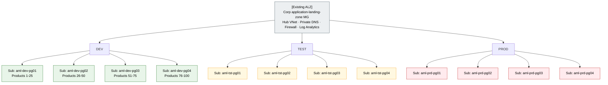
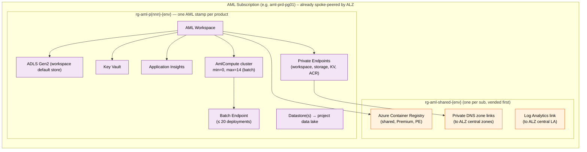
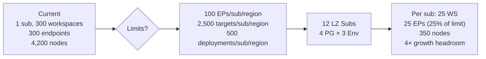

# Azure Machine Learning – Scale-Out Reference Architecture

> **Status:** Draft for review
> **Owner:** ML Platform Team
> **Last updated:** April 2026
> **Audience:** ML Platform Engineers, Product ML Leads, Cloud Architects, FinOps

---

## 0. Scope and assumptions

This document **only covers Azure Machine Learning and its directly-related resources**. The following are assumed to exist already and are **out of scope**:

- **Azure Landing Zones** (management groups, policies, hub-and-spoke networking, central logging, identity). This architecture deploys *into* an existing Corp application-landing-zone management group.
- **Subscription stamping / vending pipeline**. The organization already operates a stamping model for other workloads; **the gap this document closes is extending that stamping model to AML**.
- Identity (Entra groups / PIM), Sentinel, Defender, Log Analytics workspace, ExpressRoute, Firewall, central Private DNS zones.

What this document defines:

1. The **AML stamp** — the set of AML-specific resources that the stamping pipeline must produce inside an application-landing-zone subscription.
2. **How many AML stamps per subscription**, driven by AML regional quota limits.
3. **How to split 100 products across subscriptions** so the existing stamping pipeline can vend them predictably.
4. Day-2 operating rules for quotas, naming, and growth beyond 100 products.

---

## 1. Executive summary

The current AML estate runs **100 ML products × 3 environments (dev / test / prod) × 1 AML workspace each** inside a **single Azure subscription**, with every workspace backed by a **14-node compute cluster** running **batch** workloads. The platform is now hitting hard AML subscription-scoped limits:

| Limit (default, regional, per subscription) | Value | Where we are |
|---|---|---|
| Online + batch **endpoints** per subscription per region | **100** | 300 needed (300 workspaces × 1 endpoint) |
| **Deployments** per subscription per region (sum of online + batch) | **500** | At risk |
| **Total compute targets** per region (train clusters + CI + managed online deployments) | **500 default, 2,500 max** | 300 clusters consumes headroom |
| Dedicated cores per VM family per region | 24 – 300 default | Constrains scale-out |

Sources: [Manage quotas for Azure Machine Learning](https://learn.microsoft.com/azure/machine-learning/how-to-manage-quotas?view=azureml-api-2), [Azure subscription and service limits](https://learn.microsoft.com/azure/azure-resource-manager/management/azure-subscription-service-limits).

**Decision:** Define an **AML stamp** and plug it into the **existing subscription-stamping pipeline**. Scale horizontally by vending **12 AML-dedicated application subscriptions** (`4 product-groups × 3 environments`) under the existing Corp landing-zone hierarchy. Each subscription hosts **25 products** — 25 % of the endpoint cap, leaving ≥ 4× growth headroom. No new landing-zone, MG, networking, or identity design is introduced.

---

## 2. Why we are hitting limits (the "what")

All the limits above are **regional per subscription**. They are **credit limits, not capacity guarantees** — raising them does **not** guarantee capacity, and some limits (endpoint count, deployment count) still cap out even with an exception.

Three specific facts matter:

1. **Endpoints cap at 100 per subscription per region** – exceptions can be requested but are not elastic. At 300 endpoints needed, one subscription is structurally non-viable. ([Docs](https://learn.microsoft.com/azure/machine-learning/how-to-manage-quotas?view=azureml-api-2#azure-machine-learning-online-endpoints-and-batch-endpoints))
2. **Total compute targets cap at 2,500 per region even after a support ticket** – training clusters, compute instances **and** managed online deployments all count against the same pool. ([Docs](https://learn.microsoft.com/azure/machine-learning/how-to-manage-quotas?view=azureml-api-2#azure-machine-learning-compute))
3. **VM core quotas are per subscription per VM family per region** – 300 clusters × 14 nodes will starve any single core quota. ([Docs](https://learn.microsoft.com/azure/machine-learning/how-to-manage-quotas?view=azureml-api-2))

Because AML limits are hit at the **subscription** boundary, the only durable fix is to spread workspaces across more subscriptions. The existing stamping pipeline already knows how to vend subscriptions under the Corp landing-zone; this design simply defines the **AML stamp** to hand to it.

---

## 3. Target architecture (the "what")

### 3.1 AML subscription fan-out

AML-specific view only. Management groups, platform subscriptions, hub VNet, firewall, and central logging are **pre-existing ALZ components** and are shown as a single `[Existing ALZ]` reference.

**Totals:** 12 AML-dedicated subscriptions (no new platform subs, no MG changes).

### 3.2 The AML stamp — what the stamping pipeline must produce

When the stamping pipeline is asked to onboard a product, it deploys **one AML stamp** per product into the target subscription. A stamp is a single resource group with the AML workspace and its direct dependencies.

**Stamp contents (authoritative list):**

| Resource | Purpose | Sharing scope |
|---|---|---|
| AML Workspace | Control plane for the product | Per product |
| ADLS Gen2 (workspace default) | System artifacts, logs, job outputs | Per product |
| Key Vault | Workspace-linked secrets | Per product |
| Application Insights | Workspace telemetry | Per product |
| AmlCompute cluster (14-node batch) | Training + batch scoring | Per product |
| Batch endpoint (+ deployments) | Model serving | Per product |
| Datastore(s) | Link to project data lake (external) | Per product, read-only to shared data |
| Private endpoints for WS/ST/KV/ACR | Network isolation | Per product |
| **Shared ACR** (one per subscription) | Environment images, model images | **Shared across 25 stamps in the sub** |
| **Private DNS zone links** | Resolve AML PE FQDNs through ALZ zones | **Shared per sub** (ALZ-owned zones) |
| **Log Analytics link** | Diagnostic routing to ALZ central LA | **Shared per sub** |

### 3.3 Quota math – why 25 products per subscription

| Item | 1-sub today | 12-sub target (per sub) | % of default limit |
|---|---|---|---|
| AML workspaces | 300 | 25 | n/a |
| Batch endpoints | 300 | 25 | 25% of 100 |
| Deployments | 300 | 25 | 5% of 500 |
| Compute clusters | 300 | 25 | 5% of 500 total targets |
| Compute nodes | 4,200 | 350 | Sized per VM family core quota |

Every limit has **≥ 4× headroom** before the next split is needed, which gives room for product growth and for exception-only endpoint limit raises to buffer peaks.

---

## 4. Splitting strategy – choosing the partition key (the "how")

AML limits are regional per subscription, so the partition key must map a product to exactly one AML subscription per environment.

| Partition axis | Pros | Cons | Verdict |
|---|---|---|---|
| **By environment (dev / test / prod)** | Strict blast-radius; separate RBAC; different SLA | Doesn't solve quota alone at 100 products | **Use (primary)** |
| **By product-group (25 per sub)** | Directly solves endpoint + target limits; simple math | Group boundary is arbitrary | **Use (secondary)** |
| By business unit / domain | Clean chargeback | Uneven product counts per BU → wasted headroom | Use tags, not sub boundary |
| By region | Needed for data residency / DR | Not required by quotas | Only if regulation demands |
| Per product | Maximum isolation | 300 subs → stamping overhead, ACR / LA fan-out cost | Reject |

**Recommended partition:** `environment × product-group` → **12 AML subscriptions today**. Product-group membership is **deterministic** (e.g. `pg_index = ceil(product_id / 25)`), pinned on first onboarding. Grow by asking the existing stamping pipeline to vend `pg05`, `pg06`, … when a group crosses **20 products** (80 % of the 25-product budget).

---

## 5. Design principles (the "why")

Five principles, all scoped to AML (ALZ principles are inherited, not re-stated):

1. **Subscription = AML scale unit.** AML limits are regional per subscription, so scale out by adding AML subscriptions, not by stacking workspaces.
2. **One workspace per product per environment.** No shared prod workspace across products — aligns with [cloud-scale-analytics AML guidance](https://learn.microsoft.com/azure/cloud-adoption-framework/scenarios/cloud-scale-analytics/best-practices/azure-machine-learning#implementation-overview).
3. **Extend the existing stamping pipeline, don't fork it.** The AML stamp is a new *module* plugged into the existing vending/stamping pipeline; subscription creation, policy assignment, spoke VNet, and RBAC bootstrap already work.
4. **Private-endpoint-only workspaces.** Reuse the ALZ-owned central Private DNS zones (`privatelink.api.azureml.ms`, `privatelink.notebooks.azure.net`); each AML subscription's spoke links to them.
5. **Headroom-first packing.** Target 25 % utilization of the 100-endpoint cap (= 25 products per sub) so endpoint-count, deployment-count, and compute-target limits all have ≥ 4× growth headroom before another sub is vended.

---

## 6. Implementation blueprint (the "how")

### 6.1 Adding AML to the existing stamping pipeline

The existing stamping pipeline already does subscription creation, MG placement, policy assignment, VNet spoke, RBAC. We add **two new stamp modules** to it:

| Module | Scope | When it runs |
|---|---|---|
| `aml-sub-shared` | One per AML subscription — shared ACR, central DNS links, diagnostic settings to ALZ LA | Once, immediately after subscription vending |
| `aml-product-stamp` | One per product — the stamp in §3.2 | Every time a product is onboarded or a new env is added |

Both modules are pure IaC (Bicep or Terraform using [AVM modules](https://azure.github.io/Azure-Verified-Modules/)) and are called by the pipeline the same way other workload stamps are.

### 6.2 Naming convention

| Resource | Pattern | Example |
|---|---|---|
| Subscription | `sub-aml-{env}-pg{nn}` | `sub-aml-prd-pg01` |
| Resource group | `rg-aml-{env}-p{product_id}` | `rg-aml-prd-p042` |
| Workspace | `mlw-{env}-p{product_id}-{region}` | `mlw-prd-p042-weu` |
| Compute cluster | `cpu-batch-14n` / `gpu-batch-14n` | (same name reused per workspace) |
| Batch endpoint | `bep-p{product_id}-{purpose}` | `bep-p042-scoring` |

### 6.3 Product onboarding flow (reuses existing pipeline)

1. **Intake** (existing form): `product_id`, data classification, expected VM SKU, peak node count, region.
2. **Allocator decides target subscription** for each env (dev / tst / prd):
   - If any existing `aml-{env}-pg*` has **< 20 workspaces** AND **< 75 endpoints** AND matching region/SKU → place there.
   - Else **ask the existing stamping pipeline** to vend a new `aml-{env}-pg{nn+1}` subscription. Once vended, `aml-sub-shared` runs automatically.
3. **`aml-product-stamp` deploys** the product stamp (one per env) into the chosen subscription.
4. **Product team** registers models, datastores, and runs jobs via [AML CLI v2](https://learn.microsoft.com/azure/machine-learning/how-to-configure-cli). No platform tickets needed.

Product-group membership is derived from `product_id` and pinned on first onboarding; **workspaces never move between subscriptions** (see Risks).

### 6.4 Quota operating model

- **Quota Groups** to pool VM core quotas across the 4 (or more) product-group subs of the same environment. ([Quota Groups](https://learn.microsoft.com/azure/quotas/quota-groups))
- **Programmatic quota requests** through the [Microsoft.Quota REST API](https://learn.microsoft.com/rest/api/quota/), fired from the stamping pipeline right after `aml-sub-shared`.
- **Alerts** at 75 % utilization per subscription per VM family. ([Configure alerts](https://learn.microsoft.com/azure/quotas/how-to-guide-monitoring-alerting))
- **Endpoint-limit increase requests** pre-filed for `prd` subs that cross 70 endpoints, per the [request process](https://learn.microsoft.com/azure/machine-learning/how-to-manage-quotas?view=azureml-api-2#endpoint-limit-increases).
- **Compute-target limit** raised from 500 → 2,500 on every `prd` subscription at vending time (support ticket automated).

### 6.5 Batch-workload specific tuning

Because **all workloads are batch**, exploit these:

- Prefer **batch endpoints** over managed online endpoints — no request-rate limit, scales to the cluster capacity. Each batch endpoint can host **multiple deployments** (up to 20) tied to the same 14-node cluster; ideal for model versioning without burning the endpoint count. ([Batch endpoints](https://learn.microsoft.com/azure/machine-learning/concept-endpoints-batch?view=azureml-api-2))
- Use **low-priority nodes** where SLA permits — separate quota pool (100 – 3,000 cores/region default) that doesn't compete with dedicated cores. ([Compute quotas](https://learn.microsoft.com/azure/machine-learning/how-to-manage-quotas?view=azureml-api-2#azure-machine-learning-compute))
- Set cluster **`min_instances=0`** with short idle timeout — 14 is the *max*, not a reservation.
- Consolidate models where possible: one workspace can host multiple products sharing a lifecycle; revisit the 1:1 workspace-to-product mapping for small products once the topology is live.

---

## 7. Risks, trade-offs, and mitigations

| Risk | Impact | Mitigation |
|---|---|---|
| Cross-subscription data egress cost | Moderate | ALZ hub-and-spoke is already in place; keep datastore access on-backbone via private endpoints; co-locate project data lake and AML subscription in the same region |
| 12+ subscriptions = more to govern | Low | Inherited from existing ALZ policy + stamping pipeline; the AML stamp adds **two** modules only |
| Product-group boundary perceived as arbitrary | Low | Allocation is deterministic (hash on `product_id`) and automated; growth is additive (vend `pg05`, not reshuffle) |
| Moving existing workspaces is hard | **High** | AML workspaces **cannot** be cleanly moved across subscriptions with all artifacts. Migration plan = per-product re-provision into the new stamp + re-register models + re-point datastores. Do **not** use `az resource move` |
| Shared ACR repo density | Low | One Premium ACR per subscription is fine for 25 products (500-repo default is ample); split per 3 product-groups if repo count grows |
| Capacity not guaranteed even after raising quota | High for GPU SKUs | Use [On-demand capacity reservations](https://learn.microsoft.com/azure/virtual-machines/capacity-reservation-overview) for critical prod GPU clusters |
| Central Private DNS zone conflicts | Low | Reuse ALZ-owned zones; `aml-sub-shared` only creates **zone links**, never the zones themselves |

---

## 7a. Scaling beyond 100 products

The design is linear in subscription count. Growth = vend more product-group subs through the same stamping pipeline.

| Products | Product-groups per env | AML subs | Additional action |
|---|---|---|---|
| 100 (today) | 4 | 12 | None — baseline |
| 200 | 8 | 24 | Vend `pg05…pg08` per env via existing pipeline |
| 400 | 16 | 48 | Same. Start using **Quota Groups** to share core quotas across same-env subs |
| 1,000 | 40 | 120 | Add a **second region** for overflow + capacity reservations for GPU |

Early-warning thresholds (stamping pipeline emits alerts before each is hit):

- Workspaces in a sub ≥ **20** (80 % of budget) → vend next sub
- Batch endpoints in a sub ≥ **75** (75 % of the 100 cap) → vend next sub
- Compute targets in a sub ≥ **400** (80 % of default 500, before raise to 2,500)
- Any VM-family core quota utilization ≥ **75 %**

---

## 8. Reference links

### Quotas and limits
- [Manage and increase quotas for Azure Machine Learning](https://learn.microsoft.com/azure/machine-learning/how-to-manage-quotas?view=azureml-api-2)
- [Azure Machine Learning service limits](https://learn.microsoft.com/azure/machine-learning/resource-limits-capacity?view=azureml-api-2)
- [Azure subscription and service limits](https://learn.microsoft.com/azure/azure-resource-manager/management/azure-subscription-service-limits)
- [Quota Groups](https://learn.microsoft.com/azure/quotas/quota-groups)
- [Microsoft.Quota REST API](https://learn.microsoft.com/rest/api/quota/)
- [Quota alerts & monitoring](https://learn.microsoft.com/azure/quotas/how-to-guide-monitoring-alerting)

### AML architecture
- [What is an Azure Machine Learning workspace](https://learn.microsoft.com/azure/machine-learning/concept-workspace)
- [Azure Machine Learning as a data product for cloud-scale analytics](https://learn.microsoft.com/azure/cloud-adoption-framework/scenarios/cloud-scale-analytics/best-practices/azure-machine-learning)
- [Batch endpoints concept](https://learn.microsoft.com/azure/machine-learning/concept-endpoints-batch?view=azureml-api-2)
- [Configure private endpoint for an Azure Machine Learning workspace](https://learn.microsoft.com/azure/machine-learning/how-to-configure-private-link?view=azureml-api-2)
- [On-demand capacity reservations](https://learn.microsoft.com/azure/virtual-machines/capacity-reservation-overview)

### Stamping / vending background (out of scope but for reference)
- [Subscription vending](https://learn.microsoft.com/azure/cloud-adoption-framework/ready/landing-zone/design-area/subscription-vending)
- [Azure Verified Modules](https://azure.github.io/Azure-Verified-Modules/)

---

## 9. Decision log

| # | Decision | Rationale |
|---|---|---|
| D1 | Split by `env × product-group` → 12 AML subs at 100 products | Solves 100-endpoint and 2,500-compute-target per-subscription limits with 4× headroom |
| D2 | 25 products per subscription | Leaves a 4× growth buffer on every AML regional limit |
| D3 | One workspace per product per env | Cloud-scale-analytics AML guidance; matches lifecycle isolation |
| D4 | Extend existing subscription-stamping pipeline instead of building AML-specific vending | Reuses proven ALZ + pipeline; keeps AML-owned surface area minimal |
| D5 | Add two new stamp modules only: `aml-sub-shared` and `aml-product-stamp` | Clear separation between sub-scoped shared resources (ACR, DNS links) and product-scoped resources |
| D6 | Prefer batch endpoints + multiple deployments per endpoint (≤ 20) | Batch-only workload; multiplies model-version capacity without burning endpoint count |
| D7 | Do not attempt `az resource move` for existing workspaces | Re-provision into new stamp + re-register models + re-point datastores is the only safe migration path |
| D8 | Growth rule: vend `pg{n+1}` when an existing pg crosses 20 workspaces or 75 endpoints | Additive scaling; no reshuffle of existing products |

---

*End of document.*
